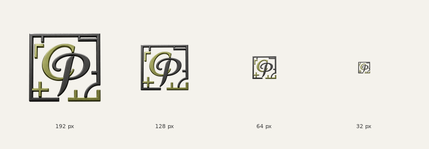

# Mag. Claudia Plessl Logo – optimierte Website-Dateien

Das Logo wurde für die Verwendung auf Websites sowie auf iPhones, iPads, Android-Smartphones und Android-Tablets optimiert.

Seit 17. August 2026 liegt dem Satz die **dreidimensionale Fassung** `logo-3d-transparent.png` zugrunde (1254 × 1254 px, freigestellt). Sie löst die zuvor flache Neuzeichnung ab. Die charakteristischen Bestandteile des ursprünglichen Logos bleiben erhalten:

- quadratischer Grundrissrahmen, jetzt als plastisch abgesetztes Profil
- olivfarbener, geschwungener Bogen mit metallischer Lichtkante
- dunkelgraues Monogramm
- ursprüngliche Anordnung und Wiedererkennbarkeit

## Dateien

Alle folgenden Dateien entstehen aus der Quelle heraus mit
[build_logo_set.py](build_logo_set.py) (`python3 logo/build_logo_set.py`) und
werden dabei überschrieben. Der Skriptlauf ist der einzige vorgesehene Weg, den
Satz zu erneuern — Handarbeit an einzelnen Größen fällt beim nächsten Lauf weg.

### Masterdateien

- [wpl-logo-master.png](wpl-logo-master.png) – transparente PNG-Masterdatei, 1024 × 1024 px
- [wpl-logo.webp](wpl-logo.webp) – verlustfreie, platzsparende WebP-Masterdatei, 1024 × 1024 px

### Responsive Website-Größen

- [wpl-logo-512.png](wpl-logo-512.png) – PNG, 512 × 512 px
- [wpl-logo-256.png](wpl-logo-256.png) – PNG, 256 × 256 px
- [wpl-logo-64.png](wpl-logo-64.png) – PNG, 64 × 64 px
- [wpl-logo-32.png](wpl-logo-32.png) – PNG, 32 × 32 px
- [wpl-logo-512.webp](wpl-logo-512.webp) – verlustfreies WebP, 512 × 512 px
- [wpl-logo-256.webp](wpl-logo-256.webp) – verlustfreies WebP, 256 × 256 px

### Favicons und Geräte-Icons

- [favicon.ico](favicon.ico) – enthält 16, 32, 48, 64, 128 und 256 px
- [apple-touch-icon.png](apple-touch-icon.png) – 180 × 180 px für iPhone und iPad
- [android-chrome-192x192.png](android-chrome-192x192.png) – 192 × 192 px für Android
- [android-chrome-512x512.png](android-chrome-512x512.png) – 512 × 512 px für Android und Web-App-Manifeste

## Prüfung der Lesbarkeit



Das Logo bleibt bei 192 und 128 px sehr gut erkennbar. Bei 64 px trägt das Monogramm noch klar, bei 32 px ist es als Marke erkennbar, die Grundrissdetails und die plastische Kante verlieren dort aber sichtbar an Zeichnung — die 3D-Fassung verträgt die kleinste Stufe etwas schlechter als die frühere flache. Für Browser-Tab und Favicon wurde diese Einbuße bewusst in Kauf genommen, damit überall dieselbe Marke steht.

## Empfohlene Einbindung auf der Website

Die Dateipfade `/assets/` müssen gegebenenfalls an die tatsächliche Ordnerstruktur der Website angepasst werden.

```html
<picture>
  <source
    type="image/webp"
    srcset="
      /assets/wpl-logo-256.webp 256w,
      /assets/wpl-logo-512.webp 512w,
      /assets/wpl-logo.webp 1024w
    "
  >
  
</picture>
```

Mit `srcset` und `sizes` kann der Browser abhängig von Bildschirmgröße und Pixeldichte eine passende Bildauflösung auswählen.

## Favicons im HTML-Kopfbereich

```html
<link rel="icon" href="/favicon.ico">
<link rel="apple-touch-icon" sizes="180x180" href="/apple-touch-icon.png">
```

## Option für ein Web-App-Manifest

Wenn die Website ein `manifest.webmanifest` verwendet, können die Android-Dateien folgendermaßen eingebunden werden:

```json
{
  "icons": [
    {
      "src": "/android-chrome-192x192.png",
      "sizes": "192x192",
      "type": "image/png"
    },
    {
      "src": "/android-chrome-512x512.png",
      "sizes": "512x512",
      "type": "image/png"
    }
  ]
}
```

## Gestaltungshinweise

- Der transparente Hintergrund ermöglicht die flexible Platzierung auf hellen und mittelhellen Flächen.
- Die vorhandene Farbvariante ist für helle bis mittelhelle Website-Hintergründe optimiert.
- Auf Schwarz nachgeprüft: Die 3D-Fassung bleibt dort lesbar, weil die Lichtkanten den Rahmen abheben — anders als bei der flachen Fassung ist eine eigene Negativversion für dunkle Flächen daher nicht zwingend.
- Das Logo sollte nicht verzerrt werden. Breite und Höhe immer proportional skalieren.
- Für reguläre Website-Header ist eine sichtbare Breite von ungefähr 90 bis 150 px sinnvoll; die konkrete Größe hängt vom Header, den Abständen und der restlichen Navigation ab.
- Rund um das Logo sollte ausreichend Freiraum bleiben, damit Grundrissrahmen und Monogramm optisch wirken können.

## Technische Umsetzung

Die Quelldatei ist eine dreidimensionale Ausarbeitung derselben Marke: Rahmen
und Monogramm sind als Relief mit Materialwirkung und gerichteter Beleuchtung
angelegt, der Hintergrund ist sauber freigestellt (rund zwei Drittel der Fläche
voll transparent, nur die Kantenglättung liegt dazwischen).

`build_logo_set.py` stellt daraus den Auslieferungssatz her:

- Motiv am Alphakanal freistellen (Schwelle 8, damit Antialiasing-Reste nicht als Motiv zählen)
- auf eine quadratische Leinwand setzen, in der das Motiv **dieselbe Höhe** einnimmt wie im früheren flachen Satz (735 von 1024 px)
- alle Größen einzeln per LANCZOS aus dem 1024-px-Master rechnen
- WebP verlustfrei, damit die Marke pixelgenau bleibt
- `favicon.ico` mit sechs eigens gerechneten Frames (16 bis 256 px)

Die Höhenangleichung ist der Grund, warum das neue Logo im Header und im Footer
exakt so groß wirkt wie das alte, obwohl die Quelle ihre Leinwand deutlich
stärker ausfüllt. Header und Footer skalieren über die Höhe (`h-10`, `h-11`,
`h-16`); am CSS musste dadurch nichts geändert werden.

## Quellen

- [MDN: Responsive Images](https://developer.mozilla.org/en-US/docs/Web/HTML/Guides/Responsive_images)
- [MDN: HTML-Element `<link>`](https://developer.mozilla.org/en-US/docs/Web/HTML/Reference/Elements/link)
